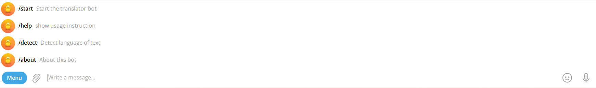
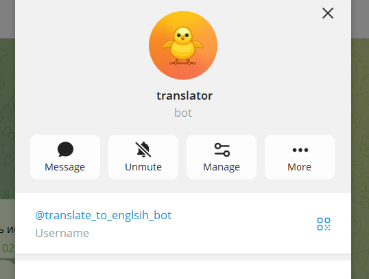
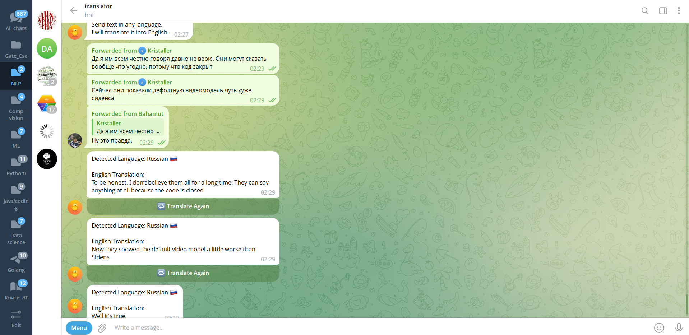

# 🌍 Telegram Translator Bot

An AI-powered Telegram bot that automatically translates text and speech from multiple languages into English in real time.

---

## 🚀 Features

✅ Auto language detection
✅ Text translation to English
✅ Voice message translation
✅ Fast response system
✅ Modular Python architecture
✅ Logging support
✅ Telegram command support
✅ Scalable backend structure

---

## ⚡ Why The Bot Is Fast

The bot is optimized for low-latency translation using:

* Asynchronous Telegram handlers
* Lightweight translation APIs
* Direct in-memory processing
* Modular architecture
* Fast polling updates

### Performance Optimizations

* Minimal blocking operations
* Efficient request handling
* Lightweight NLP pipeline
* Reusable translator instances

---

## 🧠 Project Architecture

```text
User Message
     ↓
Telegram Bot API
     ↓
Python Telegram Handler
     ↓
Language Detection
     ↓
Translation Engine
     ↓
English Output
```

---

## 🛠️ Tech Stack

| Technology          | Purpose              |
| ------------------- | -------------------- |
| Python              | Backend language     |
| python-telegram-bot | Telegram integration |
| deep-translator     | Translation engine   |
| SpeechRecognition   | Audio recognition    |
| FFmpeg              | Audio processing     |
| Git/GitHub          | Version control      |

---

## 📂 Project Structure

```bash
telegram_translator_bot/
│── app/
│   ├── bot.py
│   ├── handlers.py
│   ├── translator.py
│   ├── speech.py
│   ├── config.py
│   └── utils.py
│
│── screenshots/
│── requirements.txt
│── main.py
│── README.md
```

---

# 📸 Bot Screenshots

## 🔹 Bot Commands



---

## 🔹 Translation Process



---

## 🔹 Translation Output



---

## ⚙️ Installation

### 1️⃣ Clone Repository

```bash
git clone https://github.com/sourabhwarrior2003/telegram-translator-bot.git
```

---

### 2️⃣ Move Into Folder

```bash
cd telegram-translator-bot
```

---

### 3️⃣ Create Virtual Environment

```bash
python -m venv venv
```

---

### 4️⃣ Activate Environment

#### Windows

```bash
venv\Scripts\Activate.ps1
```

---

### 5️⃣ Install Dependencies

```bash
pip install -r requirements.txt
```

---

### 6️⃣ Add Telegram Token

Create `.env`

```env
BOT_TOKEN=YOUR_BOT_TOKEN
```

---

### 7️⃣ Run Bot

```bash
python main.py
```

---

## 🤖 Telegram Commands

| Command | Description     |
| ------- | --------------- |
| /start  | Start bot       |
| /help   | Help menu       |
| /about  | About developer |

---

## 📈 Performance

* Average translation response: < 2 seconds
* Supports multiple language inputs
* Lightweight memory usage
* Async Telegram polling system

---

## 👨‍💻 Developer

Created by:

📌 Telegram:
[@Thewarrior2003](https://t.me/Thewarrior2003)

📌 GitHub:
https://github.com/sourabhwarrior2003

---

## 🔥 Future Improvements

* OCR image translation
* Whisper AI speech recognition
* Multi-language output
* Reinforcement learning optimization
* AI summarization
* Web dashboard
* Docker deployment
* HuggingFace fine-tuning

---

## ⭐ Support

If you like this project:

* Star the repository
* Fork the project
* Share feedback
